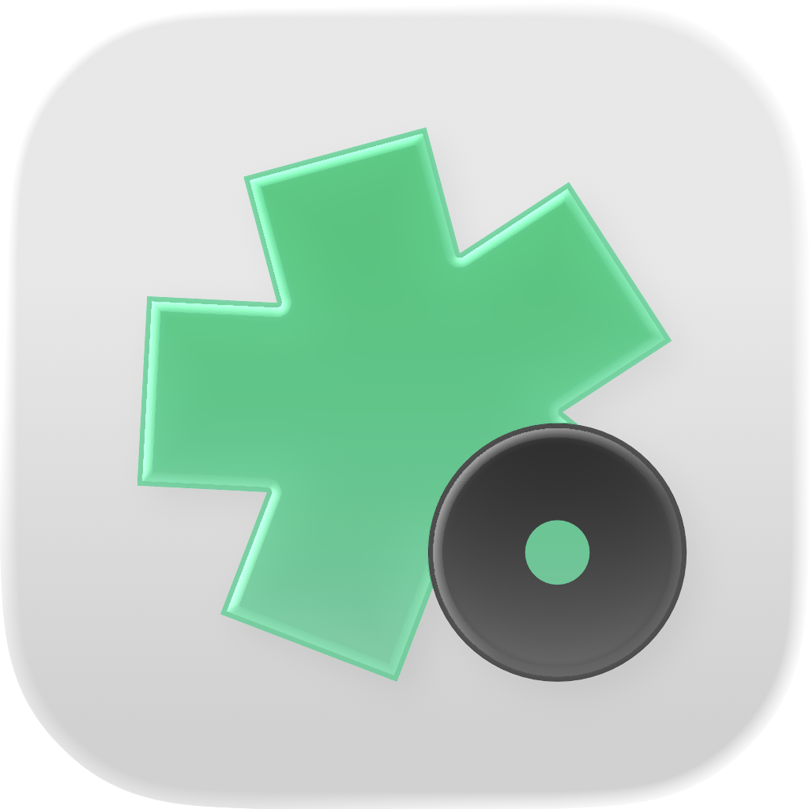

<p align="center">
  
</p>

<h1 align="center">Notiee</h1>
<h3 align="center">Schedule-Aware AI Rapid Note Capture</h3>
<h3 align="center">日程感知 AI 极速拍记</h3>

<p align="center">
  <a href="#"></a>
  <a href="#"></a>
  <a href="#"></a>
  <a href="#"></a>
  <a href="#"></a>
</p>

---

## Overview

**Notiee** is an iOS-native SwiftUI app for rapid camera note-taking with AI-powered knowledge extraction. Designed for students and professionals.

Aim your camera at a whiteboard, lecture slide, or meeting note — Notiee auto-links it to your current calendar event, runs OCR, generates a summary, extracts key points, and builds a to-do list. All offline-first, with async AI processing that resumes when connectivity returns.

---

## Features

| Feature | Description |
|---|---|
| **Today** | Dashboard with live timeline, special days (holidays/solar terms), to-dos, and daily records. Color-coded tags and custom folders. |
| **Capture** | Dark immersive camera with zoom presets, flash, burst mode, and schedule-aware auto-categorization. Smooth loading animation with circular progress. |
| **Records** | Full-text search across titles, summaries, and OCR. Multi-level folder hierarchy. System folders (Favorites, Uncategorized, Today, Pending, Trash). |
| **Record Detail** | Image viewer, AI summary, detailed content (Markdown rendering), key points, definitions, to-dos, and related note suggestions. Long-press text selection with copy/share on all text sections. |
| **Review** | Token consumption dashboard with pie charts by event, Top 5 most-consuming records, and accumulated deleted token tracking. Configurable warning threshold. |
| **Login** | TomaGo unified login with animated loading overlay and shake-to-warn effect on unagreed terms. Light/dark mode adaptive. |
| **Theme** | Notiee green accent color option alongside system default. All menu icons follow the selected accent. |
| **Live Activities** | Dynamic Island & Lock Screen with real-time event progress and countdown. |
| **AI Models** | Configurable Text and Vision LLM providers (OpenAI/Anthropic compatible). Custom model support. Connection testing. |
| **Scene Presets** | Professional, College, High School, Creator profiles — auto-adjusts AI parsing, course mode, LaTeX, and vision strategy. |
| **Lab Features** | Markdown rendering, Low Consumption Mode (on-device OCR + ANE), Full Vision Mode, Deep Association Mode, iCloud manual sync, TMN import. |
| **Backup & Restore** | `.tmn` ZIP-based archive export/import with full fidelity (images, summaries, to-dos, todos). |
| **Lottie Animations** | Airbnb Lottie engine integrated for future motion design. |
| **Localization** | 416 strings in **English**, **简体中文**, and **繁體中文** covering all UI surfaces. |

---

## Tech Stack

| Layer | Technology |
|---|---|
| **UI** | 100% SwiftUI, native blur materials, spring animations |
| **State** | `@MainActor` singleton `NotieeStore` with `@Published` properties |
| **Persistence** | Local JSON (`JSONNoteRecordStore`), `UserDefaults`, Keychain for secrets |
| **Camera** | AVFoundation with zoom presets, flash, burst mode |
| **Calendar** | EventKit with holiday/birthday/solar-term detection, course calendar marking |
| **AI Pipeline** | Async `Task`-based queue with OpenAI/Anthropic compatible APIs; `RealAIProcessingService` + mock fallback |
| **Live Activities** | ActivityKit + Widget extension |
| **Notifications** | `UNUserNotificationCenter` for event alerts |
| **Permissions** | Centralized `SystemPermissionManager` |

**Dependencies (Swift Package Manager):**

| Package | Version | Purpose |
|---|---|---|
| [lottie-ios](https://github.com/airbnb/lottie-ios) | latest | Lottie animation rendering |
| [NetworkImage](https://github.com/gonzalezreal/NetworkImage) | 6.0.1 | Async image loading with disk cache |
| [swift-markdown-ui](https://github.com/gonzalezreal/swift-markdown-ui) | 2.4.1 | Markdown rendering |
| [swift-cmark](https://github.com/swiftlang/swift-cmark) | 0.8.0 | CommonMark parsing |
| [OnboardingKit](https://github.com/danielsaidi/OnboardingKit) | main | Onboarding flow |
| [PageView](https://github.com/danielsaidi/PageView) | 0.2.0 | Paged scroll views |
| [WhatsNewKit](https://github.com/SvenTiigi/WhatsNewKit) | main | Version changelog |
| [ZIPFoundation](https://github.com/weichsel/ZIPFoundation) | 0.9.20 | .tmn archive compression |

---

## Project Structure

```text
Notiee/
├── App/
│   ├── NotieeApp.swift                # @main entry
│   └── RootTabView.swift              # 4-tab layout
├── Features/
│   ├── Today/                         # Today dashboard (4 files)
│   ├── Capture/                       # Camera + capture flow (4 files)
│   ├── Records/                       # Record archive + detail (8 files)
│   └── Settings/                      # Me, settings, login, backup (13 files)
├── Models/                            # 13 domain models
├── Services/                          # 24 infrastructure files
│   ├── NotieeStore.swift              # Central state
│   ├── NotieeStore+Actions.swift      # CRUD operations
│   ├── NotieeStore+Pipeline.swift     # AI processing pipeline
│   ├── CameraManager.swift            # AVFoundation session
│   ├── CalendarService.swift          # EventKit + holiday detection
│   ├── LocalOCRService.swift          # On-device OCR (ANE)
│   ├── ScenePreset.swift              # Usage scenario presets
│   └── ...
├── Components/                        # Reusable views
├── Utils/
│   ├── NotieeColors.swift             # Theme color system
│   ├── LottieView.swift               # Lottie wrapper
│   └── Logger.swift                   # Logging utility
├── NotieeWidget/                      # Widget + Live Activity
├── NotieeCaptureExtension/            # Camera Control extension
├── en.lproj/                          # English (416 strings)
├── zh-Hans.lproj/                     # 简体中文 (416 strings)
├── zh-Hant.lproj/                     # 繁體中文 (416 strings)
└── NotieeTests/                       # 28 unit tests
```

---

## Quick Start

- **iOS 18.0+** · **Xcode 16.0+** · **Swift 6.0+**

```bash
open Notiee.xcodeproj
# Cmd+R to run, Cmd+U to test
```

---

## Permissions

| Permission | Purpose |
|---|---|
| Camera | Capture whiteboard/notes photos |
| Microphone | Voice recording |
| Photo Library | Import existing images |
| Calendar | Read system calendar for schedule matching |
| Speech Recognition | Voice-to-text conversion |
| Notifications | Event start/end alerts |

API keys encrypted in iOS **Keychain**.

---

## Version

**v1.0.2** — Current

- [x] Theme color system with Notiee green accent
- [x] Scene presets (Professional / College / High School / Creator)
- [x] Course calendar marking & deep association mode
- [x] Redesigned login with shake-to-warn animation
- [x] Camera loading animation with circular progress
- [x] Long-press text selection on summary, detail, and OCR
- [x] Token consumption tracking (Top 5, deleted accumulation, per-record)
- [x] Schedule path deduplication & holiday filtering
- [x] Full 416-string localization (EN / zh-Hans / zh-Hant)
- [x] Lottie animation engine integration
- [x] Lab features: Full Vision, Low Consumption, Deep Association
- [ ] iCloud CloudKit sync (planned)

---

<p align="center">
  <sub>Made for people who want to focus on learning, not organizing.</sub>
</p>
