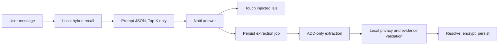

# Notti Memory Redesign

Date: 2026-08-06

Scope: shared by Notiee and Notiee+. The free target uses the self-hosted
extraction transport; Notiee+ uses the user's configured model directly.

## Goals

Notti replaces Spark as the current product and source-code name while retaining
read compatibility for persisted `spark` identifiers and legacy files. Its memory
system is local-first and inspired by Mem0's separation of extraction, resolution,
retrieval, and lifecycle management. It does not embed the Mem0 SDK or use Mem0
Cloud.

The system has one post-response write pipeline and one pre-response retrieval
pipeline. The answer model never mutates memory and no hidden CRUD tags are
parsed from its output.

## Boundaries

`NottiMemoryRepository` is an actor and the only memory write authority. The
answer model, extraction model, UI, and Agent tools can submit proposals or
explicit user commands, but cannot directly edit the snapshot.

## Domain

A `NottiMemory` has a stable UUID, category, durability, lifecycle status, topic
key, entities, keywords, temporal fields, evidence, use history, privacy class,
links, and revisions. Evidence is capped to the five newest records while
`evidenceCount` remains cumulative. Use history stores at most the newest twenty
successful prompt/tool injections.

Categories are `profile`, `preference`, `relationship`, `event`, `plan`, `state`,
and `pattern`. Durability is `durable`, `stable`, `episodic`, or `transient`.
Lifecycle is `provisional`, `active`, `superseded`, `merged`, `expired`, or
`archived`.

Repeated evidence and retrieval use are different signals. An exact repeat from
a new source message increments evidence. A retrieved candidate that is not
actually injected does not receive a touch. Pattern memories require two distinct
source messages before activation.

## Privacy

Health, exact address, contact, financial, and identity information is sensitive.
It remains pending unless the source message explicitly asks Notti to remember it
or the user confirms it in memory settings. Passwords, verification codes, API
keys, bearer/session tokens, payment card numbers, and private keys are always
rejected.

The versioned snapshot, pending proposals, extraction queue, and revisions are
AES-GCM encrypted with a dedicated 256-bit DEK stored in the non-synchronizing
Keychain. Vectors live in a separate encrypted, rebuildable sidecar. Snapshot
decryption or key failure makes memory unavailable and must never overwrite the
original ciphertext; chat continues without memory.

Memory is not synchronized through iCloud. A bounded set of recalled memories is
temporarily sent to the selected answer/extraction model, as disclosed in the
versioned Notti privacy notice.

## Extraction And Resolution

Every successful user/assistant round first appends an encrypted extraction job,
then processes it asynchronously. Jobs retry at most three times and are discarded
after seven days. The extractor sees the current user message, confirmed tool
results, and at most eight relevant local candidates. Assistant prose is never
evidence.

The extractor returns strict ADD-only proposals and optional candidate IDs plus a
relationship hint. The local resolver rejects unknown IDs and forbidden secrets,
quarantines unconfirmed sensitive facts, deduplicates exact evidence, merges a
validated semantic duplicate, or creates a new active memory that supersedes an
older same-topic fact. Only explicit user commands and confirmed destructive tools
can hard-delete.

## Retrieval And Lifecycle

Search unions semantic Top-60, BM25 Top-60, entity hits, and explicit temporal
hits. Missing embeddings degrade to BM25/entity/time. Available signals use
weights 0.50, 0.25, 0.15, and 0.10. Entity contribution is reduced by
`1 / (1 + 0.001 * (linkedCount - 1)^2)`.

Activation is `clamp(decay + evidenceBoost + accessBoost, 0.3, 1.5)`. Durable
memory does not decay. Stable, episodic, and transient half-lives are 180, 60,
and 14 days. Evidence boost is capped at 0.20 and successful-use boost at 0.30.
The system ranks by the untruncated score, then applies a 3,000-character budget.
Free injects five memories per answer; Pro and Plus inject ten.

Expired memories become `expired`. Transient memory is archived after thirty days
without evidence or use. A provisional pattern is archived after ninety days
without a second source. Durable, stable, and episodic memory is never
automatically hard-deleted.

## Compatibility And Migration

`AppTab.notti` and `RecordSource.notti` encode as `spark` for one compatibility
cycle and accept both `spark` and `notti` while decoding. Existing memory,
conversation, history, settings, and generated-folder data is migrated
idempotently. Legacy sensitive facts become pending; other legacy facts become
active with one legacy evidence record.

Legacy files and keys remain untouched for one full release. Conversation/history
copies must decode and match IDs before being selected. Only an exact placeholder
title `Spark` becomes `Notti`; historical message bodies and user titles are not
rewritten. The generated folder gains `systemRole = nottiGenerated` without
changing its UUID.

## Failure Semantics

Extraction, embedding, and queue failures never fail the answer or conversation
persistence. Corrupt vectors are discarded and rebuilt. Corrupt snapshot data is
preserved and memory becomes read-disabled. Migration is all-or-nothing; if it
cannot produce and verify the new snapshot, the legacy adapter remains read-only.

